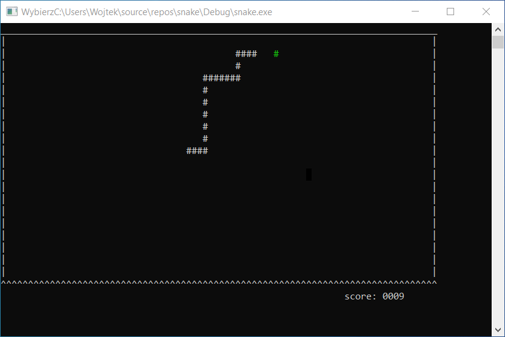
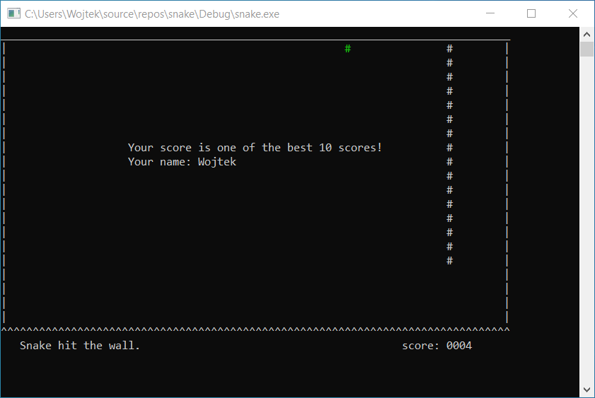

# Snake
A simple, console version of a popular game implemented in C++. The game implements different levels and a high score which is stored in a text file.

## Screenshots

## Controlls
- arrow keys - control snake direction
- up and down arrow key - choose the game menu option
- space - select the choosen option